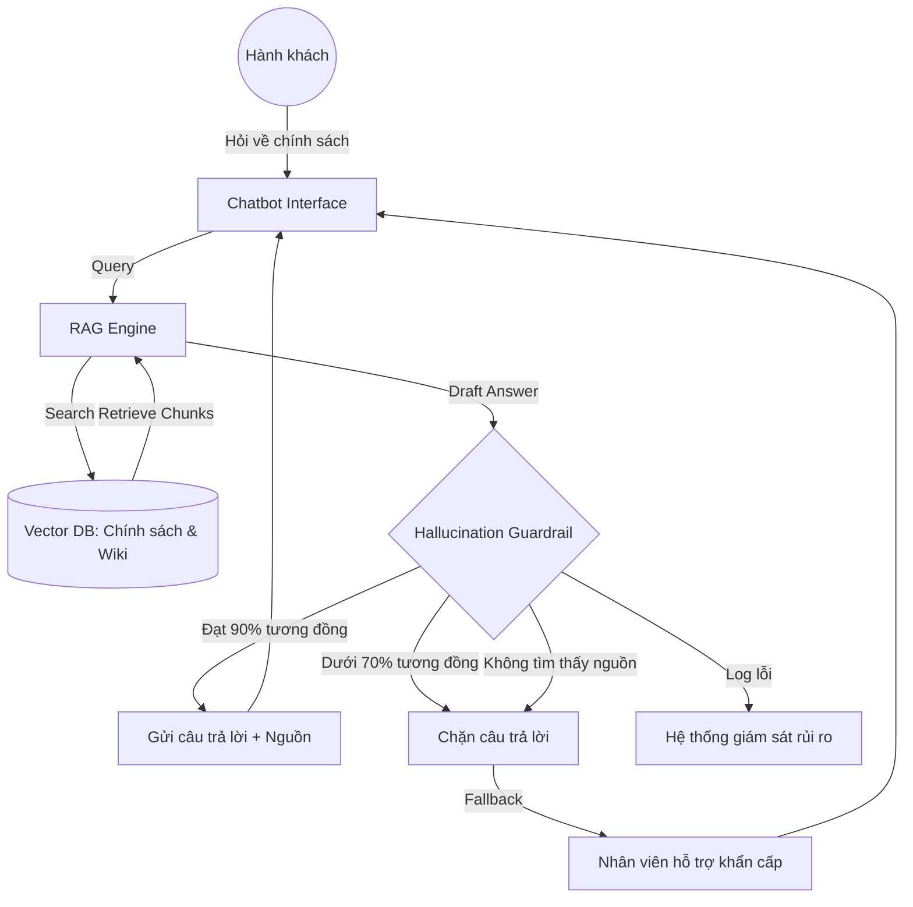

# Demo: Lớp kiến trúc dữ liệu (Architecture)

Tình huống: Hệ thống RAG và Guardrails ngăn chặn Hallucination (T-01)

## 1. Sơ đồ luồng dữ liệu

## 2. Các thành phần chính

| Thành phần | Chức năng |
|---|---|
| **Vector Database** | Lưu trữ toàn bộ PDF quy định, luật hàng không, và Wiki nội bộ của hãng. Dữ liệu được cập nhật hàng tuần. |
| **RAG Engine** | Tìm kiếm 3-5 đoạn văn bản (chunks) sát nhất với câu hỏi của người dùng để làm ngữ cảnh (context) cho AI. |
| **Hallucination Guardrail** | Một lớp logic so sánh: Nếu câu trả lời chứa các con số (phí, ngày) không xuất hiện trong chunks truy xuất -> Đánh dấu là Hallucination. |
| **Fallback System** | Khi Guardrail kích hoạt, hệ thống tự động gỡ tin nhắn AI đang soạn và hiện thông báo: "Hệ thống đang kết nối bạn với chuyên viên chính sách". |

## 3. Quy trình xử lý lỗi thực tế

**Tình huống**: Người dùng hỏi về "Giảm giá tang lễ" nhưng PDF chính sách bị lỗi không đọc được hoặc không có từ khóa đó.

1. **RAG Engine**: Tìm kiếm trong DB nhưng kết quả trả về có độ tương quan thấp (low score).
2. **AI Model**: Có xu hướng tự bịa: "Thông thường là 20%..."
3. **Guardrail Check**: Đối chiếu câu trả lời "20%" với context (rỗng/không có số 20).
4. **Action**: Guardrail phát hiện mâu thuẫn -> Chặn output -> Trigger Escalation.
5. **Monitoring**: Ghi nhận lỗi "Missing Policy Data for Bereavement" vào Dashboard để Team Policy bổ sung dữ liệu ngay.

## 4. Lợi ích kỹ thuật
- **Timeliness**: Dữ liệu không bị cũ do mô hình được huấn luyện từ lâu (training cut-off).
- **Traceability**: Mọi câu trả lời đều có ID của chunk dữ liệu đi kèm, dễ dàng truy vết khi có tranh khiếu nại.
- **Security**: Ngăn chặn Prompt Injection cố tình hỏi về bí mật kinh doanh vì DB chỉ chứa dữ liệu công khai.
